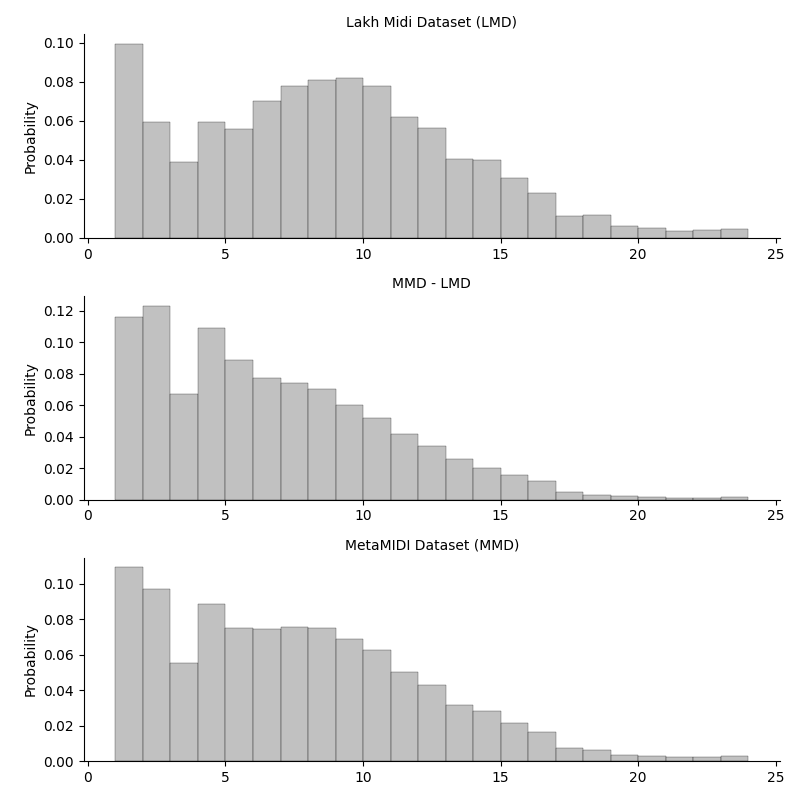
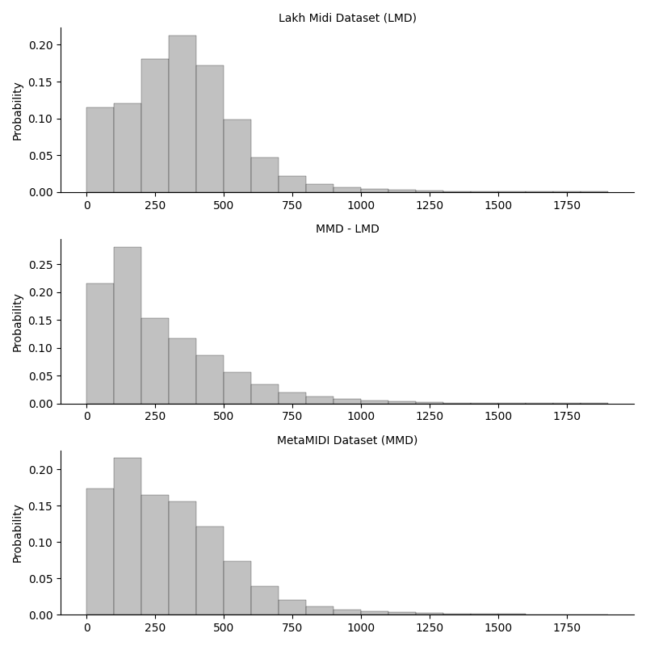
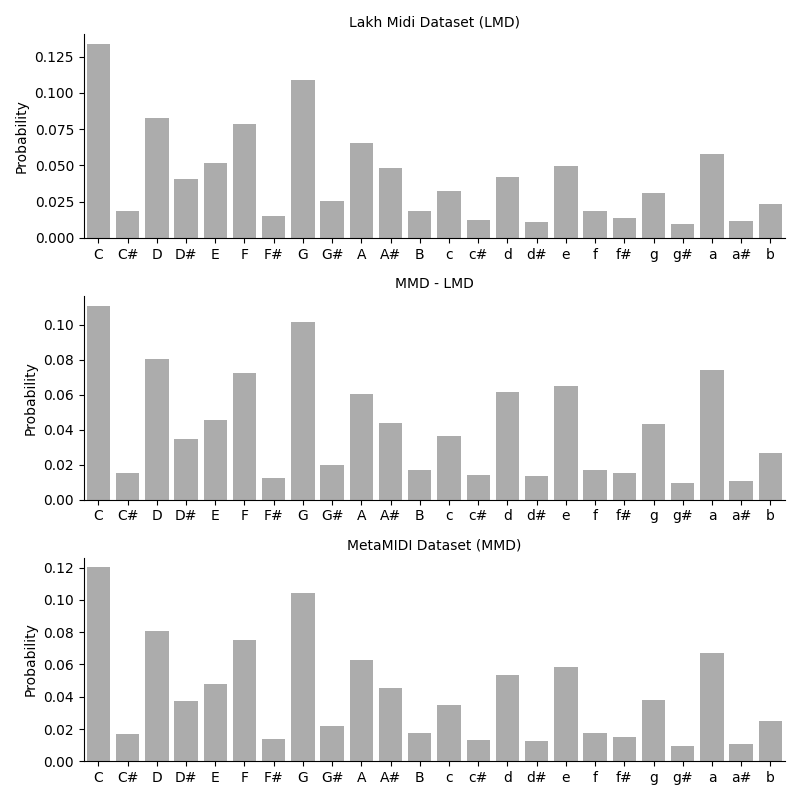
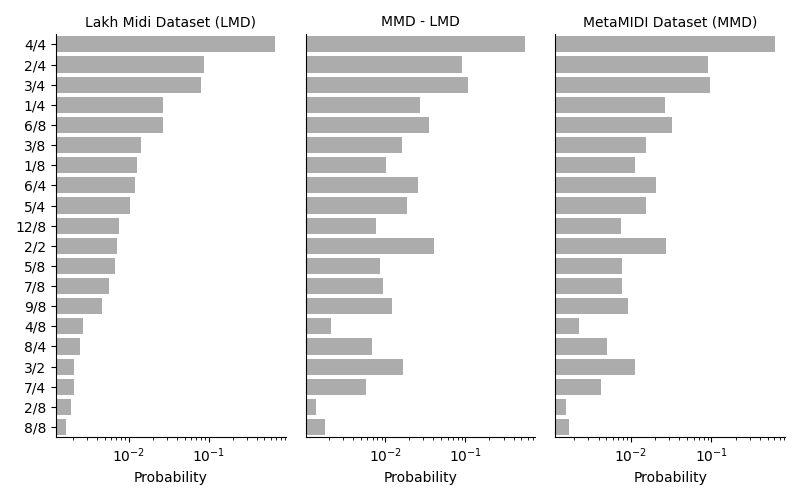
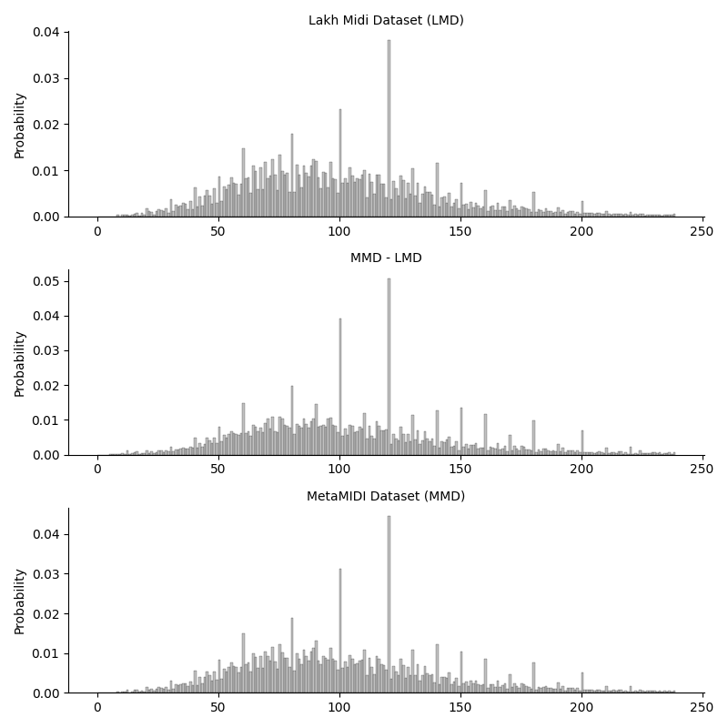
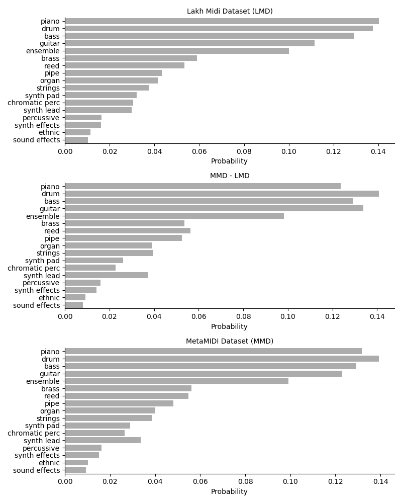
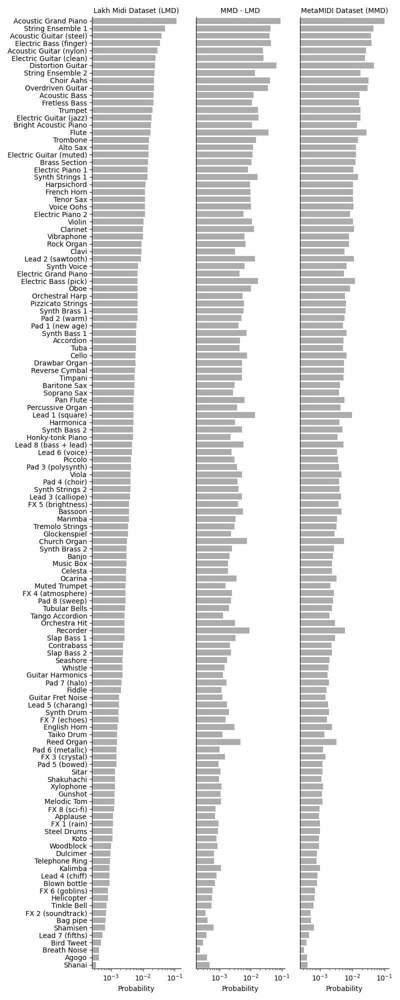

# Summary

We introduce the MetaMIDI Dataset (MMD), a large scale collection of 436,631 MIDI files and metadata. In addition to the MIDI files, we provide artist, title and genre metadata that was collected during the scraping process when available. MIDIs in (MMD) were matched against a collection of 32,000,000 30-second audio clips retrieved from Spotify, resulting in over 10,796,557 audio-MIDI matches. In addition, we linked 600,142 Spotify tracks with 1,094,901 MusicBrainz recordings to produce a set of 168,032 MIDI files that are matched to MusicBrainz database. These links augment many files in the dataset with the extensive metadata available via the Spotify API and the MusicBrainz database. We anticipate that this collection of data will be of great use to MIR researchers addressing a variety of research topics.

1. Collection of 436,631 MIDI files.
2. Scraped artist + title metadata for 221,504 MIDIs (10 times more than the LMD).
3. Scraped genre metadata for 143,868 MIDIs.
4. An improved audio-MIDI matching procedure, which produced 10,796,557 audio-MIDI matches linking 237,236 MIDIs to one or more tracks on Spotify.
5. 829,728 high reliability audio-MIDI + metadata matches linking 53,496 MIDIs to one or more tracks on Spotify.
6. A method for linking Spotify tracks and MusicBrainz recordings, producing 8,263,482 unique links that associate 1,094,901 MusicBrainz recordings with 600,142 Spotify tracks.
7. 168,032 MIDIs matched to MusicBrainz IDs via the Spotify/MusicBrainz linking procedure.

# Get the Dataset

**To protect the anonymity of the authors, files have been stored temporarily on google drive. For access to the files please use the link in the footnote. Zenodo will be used to store the dataset after review.**

## Scraped Metadata

### Artist + Title

The file MMD_scraped_title_artist.jsonl contains entries linking an md5 to a list of (title,artist) tuples. The example entry below features a MIDI file that was found on two sites, each using a slightly different artist + title.

```python
{
  "md5": "39669587387605f55ef295dba5fc0537", 
  "title_artist": [
    ["Eructavit cor meum a 6", "Gabrieli, Andrea"], 
    ["Eructavit a 6", "Andrea Gabrieli"]
  ]
}
```

### Genre

The file MMD_scraped_genre.jsonl contains entries linking an md5 to a list of genre lists. The example entry below features a MIDI file found on two sites, each using a different list of genres.

```python
{
  "md5": "611550ebcf868b21e67d87337f4be7cf", 
  "genre": [
    ["romantic"], 
    ["renaissance"]
  ]
}
```

## Audio-MIDI Matches


### Audio-MIDI Matches

The file MMD_audio_matches.tsv is a table with three columns: md5, score and sid (Spotify Track ID). The first few rows of the table are shown below. Note that it is possible to have several Spotify tracks matched to a single MIDI file.

```python
md5     score   sid
977349d0bec3fed4bd2bef1b57c597d4        0.554719562096395       5n3es2C6R47r4WGfmYL9vZ
a8ab220d3e771f14994bcb6104a6e733        0.9104702185489868      65yDyFGWY1nAAEIoPoGSL6
a8ab220d3e771f14994bcb6104a6e733        0.7431859004566854      6WRwxMiwig6czraGVt3xEB
a8ab220d3e771f14994bcb6104a6e733        0.775063317357118       6X72YoEcN8Iuw4e70NMb1V
```

### Audio-MIDI + text metadata Matches

These matches are a subset of MMD_audio_matches.tsv where scraped title + artist metadata was also a fuzzy match. As a result, they are more reliable than the audio-MIDI matches. The file MMD_audio_text_matches.tsv is a table with three columns: md5, score and sid (Spotify Track ID).

## Spotify + MusicBrainz Links

### Spotify to MusicBrainz Mapping

MMD_sid_to_mbid.json provides the list of mbids (MusicBrainz ID) corresponding to each sid (Spotify ID). Here are the first few lines of the file.

```python
{
    "4UIlhYOx9rhQgXArXHJaqN": [
        "89d239fc-aa0d-4cdc-89ba-c29691d4004c"
    ],
    "15fX8aDjlpFwq7hITsPIQU": [
        "db8bebaa-4416-4bcb-bee0-8e4dfc86307d",
        "a0c7a30c-3d0b-48d0-adef-dfb127a2c684",
        "f37c0bde-07ad-47e2-bd0f-f1d01a546b64",
        "56e366f2-6f2a-4cc0-a1de-0e6e498ad62f",
        "343c0d31-243b-4b80-bc74-fe7c36df70b2",
```

### md5 to MusicBrainz Mappings

Using the mapping in MMD_sid_to_mbid.json and the two sets of audio-MIDI matches we created the following files that map md5s to MusicBrainz IDs.

MMD_md5_to_mbid.json provides the list of MusicBrainz IDs (mbid) corresponding to each md5 checksum.

MMD_md5_to_mbid_audio_text.json provides the list of MusicBrainz IDs (mbid) corresponding to each md5 checksum, only including audio + text (md5->sid) matches.

## AcousticBrainz Genres

Using the [2018-AcousticBrainz-Genre-Task](https://multimediaeval.github.io/2018-AcousticBrainz-Genre-Task/data/) Dataset we created one file for each set of audio-MIDI matches that maps md5s to genre counts.

MMD_audio_matched_genre.jsonl contains entries specify the number of times a MIDI file was associated with a particular genre via the audio-MIDI matching and Spotify + MusicBrainz Links. In the entry below, we can see the genre counts for the discogs, tagtraum and lastfm genre taxonomies. It is worth noting that there are discrepancies between each genre taxonomy, which happen to also be exemplified in the example below.

```python
{
  "md5": "ac45c832a78728aa8822a3df637682c3", 
  "genre_discogs": {
    "electronic": 49, 
    "electronic---synth-pop": 49, 
    "folk, world, & country": 1, 
    "folk, world, & country---country": 1, 
    "pop": 49
  }, 
  "genre_tagtraum": {
    "country": 1, 
    "country---contemporarycountry": 1, 
    "country---neotraditionalcountry": 1, 
    "soundtrack": 49, 
    "soundtrack---broadway": 49, 
    "soundtrack---musical": 49
  }, 
  "genre_lastfm": {
    "country": 1, 
    "rock": 49, 
    "rock---classicrock": 49, 
    "rock---softrock": 49
  }
}
```

MMM_audio_text_matched_genre.jsonl is formated in the same manner.

## Copyright

Since we did not transcribe any of the MIDI files in the MetaMIDI Dataset, we provide a list of all the Copyright meta-events in the dataset to acknowledge the original authors of the files. This is available in MMD_copyright.txt.

# Dataset Statistics

In what follows we compare distributions for the LMD, MMD and the symmetric difference between the MMD and the LMD (i.e. MMD - LMD).

## Number of Tracks per MIDI file


Figure 1: A track consists of all the events belonging to a unique (MIDI track,channel,instrument) tuple.

## Number of beats



Figure 2: The number of quarter note beats in a MIDI file. This is a tempo-invariant indicator of the length of the MIDI file.

## Key Signatures



Figure 3: The usage of different key signatures.

## Time Signatures



Figure 4: The usage of different time signatures.

## Tempo



Figure 5: The different tempo used. Note the spikes, which correspond to standard default tempos (ex. 120bpm).

## General MIDI Instrument Type


Figure 6 : The usage of General MIDI instrument types in the LMD and MMD.

## General Midi Instrument


Figure 7: The usage of General MIDI instruments in the LMD and MMD.


